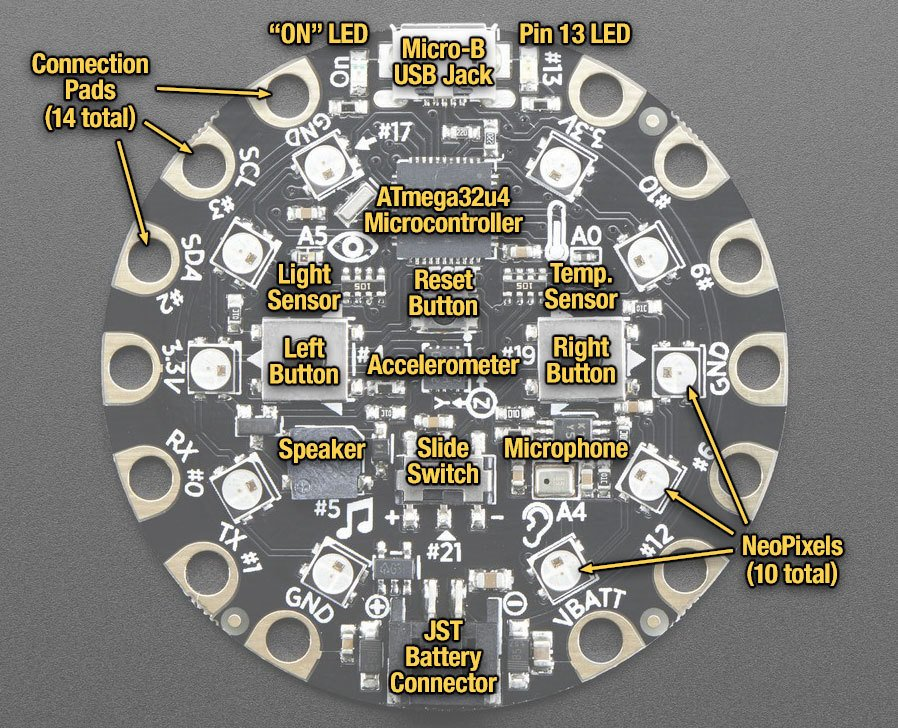
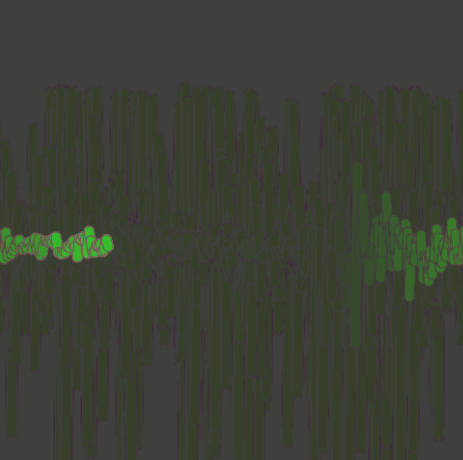

   
Use other features of an Adafruit Circuit Playground as an input device in a Processing program
===============================================================================================
In this Arduino lab you will write a program that uses other features of the Adafruit Circuit Playground as an controller for a Processing program. The circuit playground has 16 inputs. Adafruit has a detailed description [here](https://learn.adafruit.com/introducing-circuit-playground/guided-tour). In addition to the light sensor that we used in the previous assignment, the circuit playground also has a:
* Temperature Sensor
* Microphone Audio Sensor
* Motion Sensor
* A 3-axis accelerometer
* Capacitive Touch sensor
* Two large left and right buttons
* Small center button
* Slide switch 

Here's a sample program that will print the values of 16 inputs. Run the program and then press, touch and manipulate the various sensors to see how they work.
```java {.line-numbers}
import processing.serial.*;
import cc.arduino.*;
Arduino arduino;

public void setup() {
  size(100, 100);
  arduino = new Arduino(this, Arduino.list()[0], 57600);
}

public void draw() {
  background(192);
  for(int i = 0; i < 16; i++)
    System.out.print(i+" "+arduino.analogRead(i) + "\t");
  System.out.println();
}
```
Write your own program
----------------------
Using the sample program as a guide, write your own program that uses one or more of the inputs. Your program doesn't have to work or look like any other. Have fun and be creative! Submit the .pde file to Google Classroom when you are happy with your program. You should be able to find it in the *My Documents | Processing* folder. Don't forget to click the *Mark as done* button.

Samples of Student Work
-----------------------
Here's a program where the student used the microphone input to create an oscilloscope   
   
In this program the student used both the light sensor and the buttons to control the rotating pattern of dots
   
